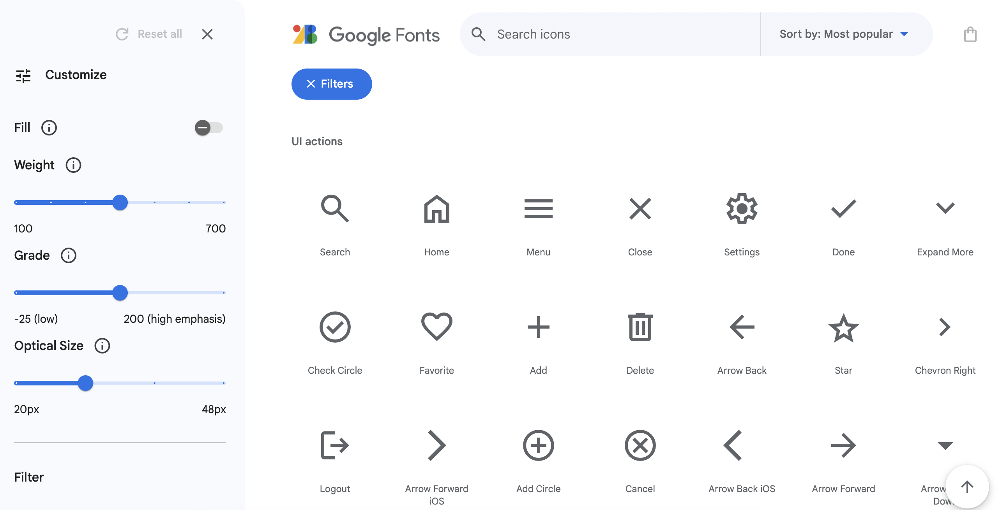
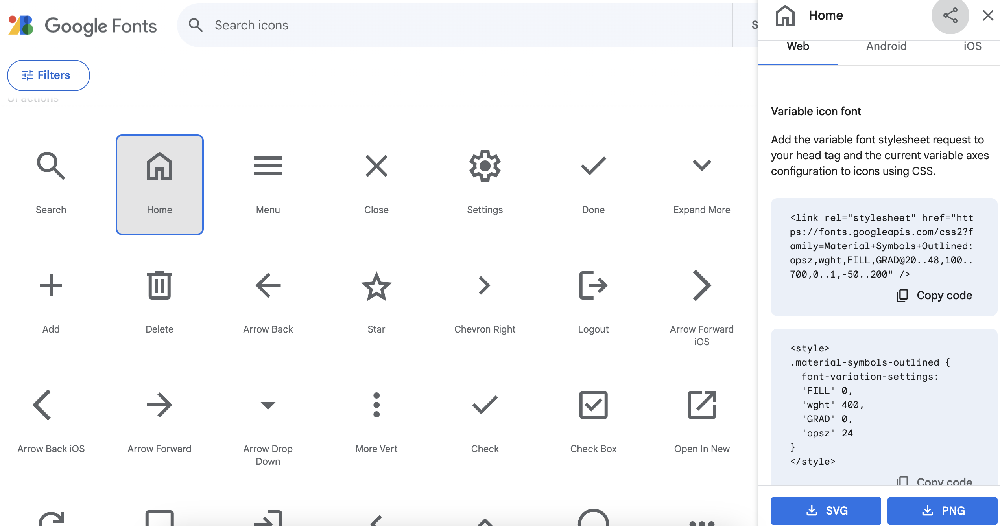

Google Material Icons are a set of customisable, vector icons designed and maintained by Google. They are widely used in web and mobile app development to make the visual appeal of user interfaces better.

Open [fonts.google.com](https://fonts.google.com/icons){:target="_blank"}. The link will open in a new tab. 

You can search for specific icons on the website. The website provides an extensive library of icons, each with a unique name. You can find icons suitable for your project by browsing or using the search functionality on the site.

Click on the icon you would like to add. This will open a modal with instructions on how to add the icon to your project. 

### Include Material Icons Font in HTML

Add the `<link>` element in the `<head>` section of your HTML file to include the Material Icons font. This link will import the Material Icons font from the Google Fonts API.

--- code ---
---
language: html
filename: index.html
line_numbers: true
---

    <head>
      <meta charset="UTF-8">
      <meta http-equiv="X-UA-Compatible" content="IE=edge">
      <meta name="viewport" content="width=device-width, initial-scale=1.0">
      <link rel="stylesheet" href="style.css">
      <link rel="stylesheet" href="https://fonts.googleapis.com/icon?family=Material+Icons">
    </head>
  
--- /code ---

### Use Material Icons in HTML

You can then use Material Icons in your HTML by adding the appropriate class to an HTML element. 

For example:

--- code ---
---
language: html
filename: index.html
line_numbers: true
---

    <body>
      

        home
      

    </body>
  
--- /code ---
   
### CSS styling

You can apply the icon’s custom styles to the CSS stylesheet of your project and personalise it to your preference.

--- code ---
---
language: css
filename: style.css
line_numbers: true
---

.material-symbols-outlined {
      font-variation-settings:
      'FILL' 0,
      'wght' 400,
      'GRAD' 0,
      'opsz' 24
}
  
--- /code ---

### Testing

Run your project to verify that the Material Icons are displayed correctly. If everything is set up properly, you should see the icons styled according to the provided classes.
