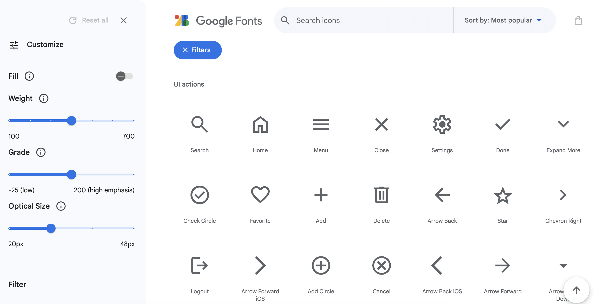
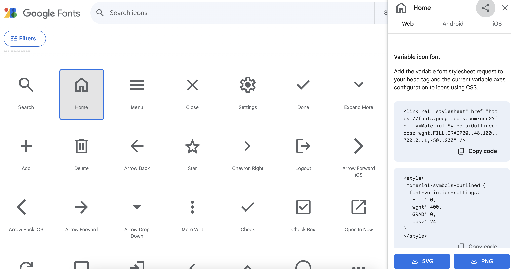

Google Material Icons 是一组由 Google 设计和维护的可定制矢量图标。 它们广泛应用于网络和移动应用程序开发，以提高用户界面的视觉吸引力。

打开 [fonts.google.com](https://fonts.google.com/icons){:target="_blank"}. 该链接将在新选项卡中打开。

你可以在网站上搜索特定的图标。 该网站提供了一个丰富的图标库，每个图标都有一个独特的名称。 你可以通过浏览或使用网站上的搜索功能来找到适合您项目的图标。

单击你想要添加的图标。 这将打开一些有关如何将图标添加到项目的说明。 

### 在 HTML 中包含 Material Icons 字体

在 HTML 文件的 `<head>` 部分中添加 `<link>` 元素以包含 Material Icons 字体。 此链接将从 Google Fonts API 导入 Material Icons 字体。

--- code ---
---
language: html
filename: index.html
line_numbers: true
---

    <head>
      <meta charset="UTF-8">
      <meta http-equiv="X-UA-Compatible" content="IE=edge">
      <meta name="viewport" content="width=device-width, initial-scale=1.0">
      <link rel="stylesheet" href="style.css">
      <link rel="stylesheet" href="https://fonts.googleapis.com/icon?family=Material+Icons">
    </head>
  
--- /code ---

### 在 HTML 中使用 Material Icons

然后，你可以通过向 HTML 元素添加适当的类来在 HTML 中使用 Material Icons。

例如：

--- code ---
---
language: html
filename: index.html
line_numbers: true
---

    <body>
      

        home
      

    </body>
  
--- /code ---

### CSS 样式

你可以将图标的自定义样式应用到项目的 CSS 样式表中，并根据你的喜好进行个性化设置。

--- code ---
---
language: css
filename: style.css
line_numbers: true
---

.material-symbols-outlined {
      font-variation-settings:
      'FILL' 0,
      'wght' 400,
      'GRAD' 0,
      'opsz' 24
}
  
--- /code ---

### 测试

运行你的项目以验证 Material Icons 是否正确显示。 如果一切设置正确，你应该会看到根据提供的类设置样式的图标。
